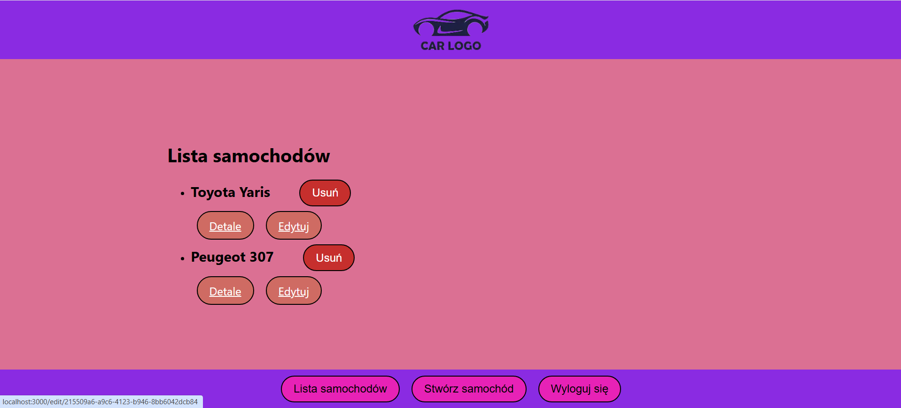
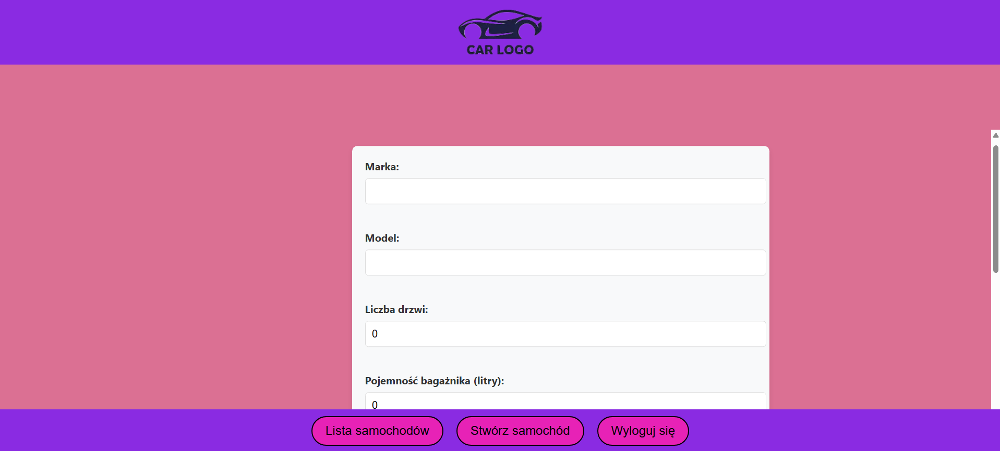
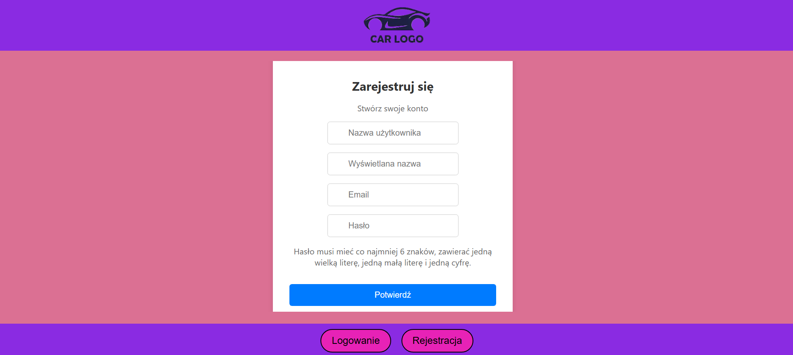

# 🚗 Aplikacja Samochodowa

Prosta aplikacja webowa do zarządzania samochodami — z możliwością tworzenia konta, logowania oraz pełną obsługą CRUD (Create, Read, Update, Delete) dla samochodów.

## 🛠️ Stack technologiczny

- **Frontend**: React
- **Backend**: C# (.NET)

## 🔐 Funkcjonalności

### Ekran startowy:
- 🔑 Przycisk **Logowanie**
- 📝 Przycisk **Rejestracja**

### Po zalogowaniu:
- 📋 **Lista Samochodów** – podgląd dostępnych aut
- ➕ **Stwórz Samochód** – formularz do dodania nowego auta
- 🔓 **Wyloguj się**

### Lista samochodów:
- 👁️ Przegląd szczegółów każdego auta
- ✏️ Edycja danych samochodu
- 🗑️ Usuwanie samochodów

### Dodawanie samochodu:
- Uzupełnienie danych pojazdu
- Zatwierdzenie formularza dodaje auto do listy

## 🔧 Jak uruchomić?

1. **Backend (C#)**
   - Przejdź do folderu backendu
   - Uruchom aplikację (np. w Visual Studio lub przez `dotnet run`)

2. **Frontend (React)**
   - Przejdź do folderu frontendu
   - Zainstaluj zależności:
     ```bash
     npm install
     ```
   - Uruchom projekt:
     ```bash
     npm start
     ```

## 📸 Zrzuty ekranu

### Ekran powitalny


### Lista samochodów


### Formularz dodawania samochodu


### Ekran rejestracji



